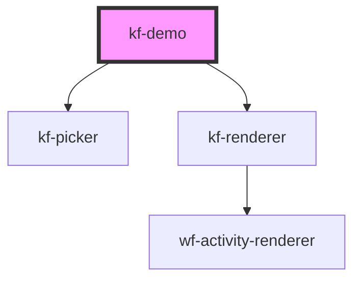

# kf-demo

<!-- Auto Generated Below -->

## Properties

| Property                  | Attribute                   | Description | Type     | Default                                                                                                                                                                                                                                                                                                                                                                                                                                                                                                                                                                                                                                                                   |
| ------------------------- | --------------------------- | ----------- | -------- | ------------------------------------------------------------------------------------------------------------------------------------------------------------------------------------------------------------------------------------------------------------------------------------------------------------------------------------------------------------------------------------------------------------------------------------------------------------------------------------------------------------------------------------------------------------------------------------------------------------------------------------------------------------------------- |
| `activityDefinitionsData` | `activity-definitions-data` |             | `string` | `'[{"type": "Custom", "displayName": "Custom", "description": "Custom Activity", "category": "Custom", "designer": { "outcomes": ["Done"] }}]'`                                                                                                                                                                                                                                                                                                                                                                                                                                                                                                                           |
| `workflowData`            | `workflow-data`             |             | `string` | `'{"activities":[{"id":"timer","top":10,"left":10,"type":"TimerEvent","state":{}, "executed":true},{"id":"send-email","top":220,"left":100,"type":"SendEmail","state":{}, "blocking":true},{"id":"if-else","top":100,"left":500,"type":"IfElse","state":{}},{"id":"log","top":300,"left":400,"type":"Log","state":{}, "faulted":true, "message":{"title":"Faulted","content":"This didnt work."}}],"connections":[{"sourceActivityId":"timer","destinationActivityId":"if-else","outcome":"Done"},{"sourceActivityId":"if-else","destinationActivityId":"send-email","outcome":"True"},{"sourceActivityId":"if-else","destinationActivityId":"log","outcome":"False"}]}'` |

## Dependencies

### Depends on

- [kf-picker](../kf-components/kf-picker)
- [kf-renderer](../kf-components/kf-renderer)

### Graph

----------------------------------------------

*Built with [StencilJS](https://stenciljs.com/)*
