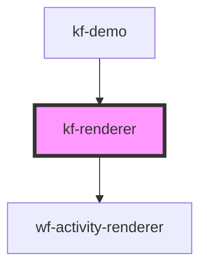

# kf-renderer

<!-- Auto Generated Below -->

## Properties

| Property              | Attribute       | Description | Type                                                     | Default                                                   |
| --------------------- | --------------- | ----------- | -------------------------------------------------------- | --------------------------------------------------------- |
| `activityDefinitions` | --              |             | `ActivityDefinition[]`                                   | `[]`                                                      |
| `canvasHeight`        | `canvas-height` |             | `string`                                                 | `undefined`                                               |
| `workflow`            | --              |             | `{ activities: Activity[]; connections: Connection[]; }` | `{         activities: [],         connections: []     }` |

## Dependencies

### Used by

 - [kf-demo](../../demo)

### Depends on

- [wf-activity-renderer](../../components/workflow-designer/activity-renderer)

### Graph

----------------------------------------------

*Built with [StencilJS](https://stenciljs.com/)*
